# Lesson01-Web 请求全过程

1、用户机请求服务器

2、服务器响应用户机并返回数据


## 第一种情况

用户机请求服务器，服务器响应用户机直接返回静态文件和数据


## 第二种情况

用户机请求服务器，服务器响应用户机直接返回静态页面结构，用户再次请求数据，服务器响应返回数据


# Lesson2-浏览器的使用

Chrome 浏览器 F12 开发工具介绍

Network XHR（ajax） 加载数据的网络请求


# Lesson3-HTTP协议

- 请求
  - 1

​	请求行 -> 请求方式（get/post） 请求url 协议

​	请求头 -> 放服务器的一些附加信息
​	 [空行]（分割作用）

​	请求体 -> 放一些请求参数

- 响应

  状态行 -> 协议、状态码

  响应头 -> 客户端使用的附带信息

  [空行]（分割作用）

  响应体 -> 服务器返回的真正内容


# Lesson4-Requests库

## get 请求

### 无参数请求

```python
import requests 

content = '周杰伦'
response = requests.get(f'https://www.sogou.com/web?query={content}')
response.text
```

提示访问出错，原因服务器需要特定请求头，查看一下默认请求头

```python
import requests

content = "周杰伦"
response = requests.get(f"https://www.sogou.com/web?query={content}")
response.request.headers
```

输出：

```json
{
    "User-Agent": "python-requests/2.31.0",
    "Accept-Encoding": "gzip, deflate",
    "Accept": "*/*",
    "Connection": "keep-alive",
    "Cookie": "ABTEST=1|1695191285|v17; SNUID=0C9BF2A3D6D0D011AFBD2BE6D619FC09; IPLOC=CN6101; SUID=DA4D24755019870A00000000650A90F5; cuid=AAGtL+RnRwAAAAqHS2RBCQAAEAM=",
}
```

加入请求头的User-Agent访问：

```python
import requests

head = {
    "User-Agent": "Mozilla/5.0 (Windows NT 6.1) AppleWebKit/537.36 (KHTML, like Gecko) Chrome/41.0.2228.0 Safari/537.36",
}

content = "周杰伦"
response = requests.get(f"https://www.sogou.com/web?query={content}", headers=head)
response.text
```

### get请求的参数请求

get请求也可以传递参数，例如

https://movie.douban.com/j/chart/top_list?type=20&interval_id=100%3A90&action=&start=0&limit=20

？后面即为参数=值，用&连接

```python
import requests

head = {
    "User-Agent": "Mozilla/5.0 (Windows NT 6.1) AppleWebKit/537.36 (KHTML, like Gecko) Chrome/41.0.2228.0 Safari/537.36",
}

url = "https://movie.douban.com/j/chart/top_list"
data = {
    "type": "20",
    "interval_id": "100:90",
    "action": "",
    "start": "0",
    "limit": "2",
}

content = "周杰伦"
response = requests.get(url, headers=head, params=data)
response.json()
```

输出

```json
[{'rating': ['9.0', '45'],
  'rank': 1,
  'cover_url': 'https://img9.doubanio.com/view/photo/s_ratio_poster/public/p1021883305.jpg',
  'is_playable': True,
  'id': '1293181',
  'types': ['悬疑', '惊悚', '恐怖'],
  'regions': ['美国'],
  'title': '惊魂记',
  'url': 'https://movie.douban.com/subject/1293181/',
  'release_date': '1960-06-16',
  'actor_count': 30,
  'vote_count': 298061,
  'score': '9.0',
  'actors': ['安东尼·博金斯',
   '维拉·迈尔斯',
   '约翰·加文',
   '珍妮特·利',
   '马丁·鲍尔萨姆',
   '约翰·麦克因泰',
   '西蒙·奥克兰',
   '弗兰克·艾伯森',
   '帕特里夏·希区柯克',
   '沃恩·泰勒',
   '卢伦·塔特尔',
   '约翰·安德森',
   '莫特·米尔斯',
   '吉特·卡森',
   '维吉尼亚·格雷格',
   '阿尔弗雷德·希区柯克',
   '珍妮特·诺兰',
   '罗伯特·奥斯本',
   '海伦·华莱士',
   '沃尔特·培根',
   '弗朗西斯·德塞尔斯',
   '乔治·多克斯塔德',
   '乔治·埃尔德雷奇',
   '哈珀·弗莱厄蒂',
   '萨姆·弗林特',
   '弗兰克·基尔蒙德',
   '泰德·奈特',
   '帕特·麦卡弗里',
   '汉斯-乔基姆·默比斯',
   '弗雷德·谢威勒'],
  'is_watched': False},
 {'rating': ['8.8', '45'],
  'rank': 2,
  'cover_url': 'https://img9.doubanio.com/view/photo/s_ratio_poster/public/p726839485.jpg',
  'is_playable': False,
  'id': '1417598',
  'types': ['悬疑', '惊悚', '恐怖'],
  'regions': ['美国'],
  'title': '电锯惊魂',
  'url': 'https://movie.douban.com/subject/1417598/',
  'release_date': '2004-01-19',
  'actor_count': 17,
  'vote_count': 537215,
  'score': '8.8',
  'actors': ['雷·沃纳尔',
   '加利·艾尔维斯',
   '丹尼·格洛弗',
   '梁振邦',
   '迪娜·迈耶',
   '迈克·巴特斯',
   '保罗·古德勒支',
   '迈克尔·爱默生',
   '本尼托·马丁内斯',
   '肖妮·史密斯',
   '麦肯兹·韦加',
   '莫妮卡·波特',
   '耐德·巴拉米',
   '亚丽姗德拉·全',
   '托宾·贝尔',
   '汉斯·雷斯',
   '奥伦·科尔斯'],
  'is_watched': False}]
```


## post 请求

POST请求往往需要提交参数，以百度翻译为例，其输入


```python
import requests

head = {
    "User-Agent": "Mozilla/5.0 (Windows NT 6.1) AppleWebKit/537.36 (KHTML, like Gecko) Chrome/41.0.2228.0 Safari/537.36",
}

# post 为 {kw:hello}
post_data = {"kw": "hello"}
query = "周杰伦"
response = requests.post("https://fanyi.baidu.com/sug", headers=head, data=post_data)
# 返回文本信息
response.text
```

```
'{"errno":0,"data":[{"k":"hello","v":"int. \\u6253\\u62db\\u547c; \\u54c8\\u55bd\\uff0c\\u5582; \\u4f60\\u597d\\uff0c\\u60a8\\u597d; \\u8868\\u793a\\u95ee\\u5019 n. \\u201c\\u5582\\u201d\\u7684\\u62db\\u547c\\u58f0\\u6216\\u95ee\\u5019\\u58f0 vi. \\u558a\\u201c\\u5582"},{"k":"hellos","v":"n. \\u5582( hello\\u7684\\u540d\\u8bcd\\u590d\\u6570 )"},{"k":"hellow","v":"\\uff08\\u901a\\u5e38\\u7684\\u62db\\u547c\\u8bed\\uff09\\u55e8\\uff0c \\uff08\\u6253\\u7535\\u8bdd\\u7528\\uff09\\u5582\\uff01\\uff0c \\uff08\\u82f1\\uff09\\uff08\\u8868\\u793a\\u60ca\\u8bb6\\uff09\\u54ce\\u54df"},{"k":"hello girl","v":"\\u5973\\u8bdd\\u52a1\\u5458; \\u5973\\u7535\\u8bdd\\u63a5\\u7ebf\\u5458"},{"k":"hello kitty","v":"n. \\u5361\\u901a\\u4e16\\u754c\\u4e2d; \\u6709\\u8fd9\\u6837\\u4e00\\u53ea\\u5c0f\\u732b; \\u6ca1\\u6709\\u5634\\u5df4; \\u8138\\u86cb\\u5706\\u5706\\u7684"}],"logid":2218552173}'
```

```python
# 返回json数据
response.json()
```

```json
{'errno': 0,
 'data': [{'k': 'hello',
   'v': 'int. 打招呼; 哈喽，喂; 你好，您好; 表示问候 n. “喂”的招呼声或问候声 vi. 喊“喂'},
  {'k': 'hellos', 'v': 'n. 喂( hello的名词复数 )'},
  {'k': 'hellow', 'v': '（通常的招呼语）嗨， （打电话用）喂！， （英）（表示惊讶）哎哟'},
  {'k': 'hello girl', 'v': '女话务员; 女电话接线员'},
  {'k': 'hello kitty', 'v': 'n. 卡通世界中; 有这样一只小猫; 没有嘴巴; 脸蛋圆圆的'}],
 'logid': 2218552173}
```

# Lesson5-数据解析概述

- re解析

- bs4解析

- xpath解析

- pyquery解析

# Lesson6-re正则表达式

测试网址：https://tool.oschina.net/regex

## re规则

### 基本字符

| 模式        | 描述                                                         |
| :---------- | :----------------------------------------------------------- |
| ^           | 匹配字符串的开头                                             |
| $           | 匹配字符串的末尾。                                           |
| .           | 匹配任意字符，除了换行符，当re.DOTALL标记被指定时，则可以匹配包括换行符的任意字符。 |
| [...]       | 用来表示一组字符,单独列出：[amk] 匹配 'a'，'m'或'k'          |
| [^...]      | 不在[]中的字符：[^abc] 匹配除了a,b,c之外的字符。             |
| a\| b       | 匹配a或b                                                     |
| (re)        | 对正则表达式分组并记住匹配的文本，可表达为一个组             |
| (?imx)      | 正则表达式包含三种可选标志：i, m, 或 x 。只影响括号中的区域。 |
| (?-imx)     | 正则表达式关闭 i, m, 或 x 可选标志。只影响括号中的区域。     |
| (?: re)     | 类似 (...), 但是不表示一个组                                 |
| (?imx: re)  | 在括号中使用i, m, 或 x 可选标志                              |
| (?-imx: re) | 在括号中不使用i, m, 或 x 可选标志                            |
| (?#...)     | 注释.                                                        |
| (?= re)     | 前向肯定界定符。如果所含正则表达式，以 ... 表示，在当前位置成功匹配时成功，否则失败。但一旦所含表达式已经尝试，匹配引擎根本没有提高；模式的剩余部分还要尝试界定符的右边。 |
| (?! re)     | 前向否定界定符。与肯定界定符相反；当所含表达式不能在字符串当前位置匹配时成功 |
| (?> re)     | 匹配的独立模式，省去回溯。                                   |
| \w          | 匹配字母数字及下划线                                         |
| \W          | 匹配非字母数字及下划线                                       |
| \s          | 匹配任意空白字符，等价于 **[ \t\n\r\f]**。                   |
| \S          | 匹配任意非空字符                                             |
| \d          | 匹配任意数字，等价于 [0-9].                                  |
| \D          | 匹配任意非数字                                               |
| \A          | 匹配字符串开始                                               |
| \Z          | 匹配字符串结束，如果是存在换行，只匹配到换行前的结束字符串。 |
| \z          | 匹配字符串结束                                               |
| \G          | 匹配最后匹配完成的位置。                                     |
| \b          | 匹配一个单词边界，也就是指单词和空格间的位置。例如， 'er\b' 可以匹配"never" 中的 'er'，但不能匹配 "verb" 中的 'er'。 |
| \B          | 匹配非单词边界。'er\B' 能匹配 "verb" 中的 'er'，但不能匹配 "never" 中的 'er'。 |
| \n, \t, 等. | 匹配一个换行符。匹配一个制表符。等                           |
| \1...\9     | 匹配第n个分组的内容。                                        |
| \10         | 匹配第n个分组的内容，如果它经匹配。否则指的是八进制字符码的表达式。 |

### 量词

控制前面元字符出现的次数

| 实例      | 描述                                                         |
| :-------- | :----------------------------------------------------------- |
| re*       | 匹配0个或多个的表达式。                                      |
| re+       | 匹配1个或多个的表达式。                                      |
| re?       | 匹配0个或1个由前面的正则表达式定义的片段，非贪婪方式         |
| re{ n}    | 精确匹配 n 个前面表达式。例如， **o{2}** 不能匹配 "Bob" 中的 "o"，但是能匹配 "food" 中的两个 o。 |
| re{ n,}   | 匹配 n 个前面表达式。例如， o{2,} 不能匹配"Bob"中的"o"，但能匹配 "foooood"中的所有 o。"o{1,}" 等价于 "o+"。"o{0,}" 则等价于 "o*"。 |
| re{ n, m} | 匹配 n 到 m 次由前面的正则表达式定义的片段，贪婪方式         |

### 贪婪匹配

| 实例 |                                              |
| :--- | :------------------------------------------- |
| .*   | 贪婪匹配，尽可能匹配多的结果                 |
| .*?  | 惰性匹配，先找最多的，在尽可能匹配最少的结果 |

## re module

### re.compile 函数

compile 函数用于编译正则表达式，生成一个正则表达式（ Pattern ）对象，供 match() 和 search() 这两个函数使用。

```python
s = "boo123bos12dfo2o23o1232321b1oo"
pattern = re.compile('\d+') 
pattern.findall(s)

# 输出
# ['123', '12', '2', '23', '1232321', '1']
```

### re.findall 函数

字符串中找到正则表达式所匹配的所有子串，并返回一个列表

```python
import re

result = re.findall(r'\d+', 'boo123bos12dfo2o23o1232321b1oo')
print(result)

# 输出
# ['123', '12', '2', '23', '1232321', '1']
```

### re.finditer

和 findall 类似，在字符串中找到正则表达式所匹配的所有子串，并把它们作为一个迭代器返回，迭代器可以提高速度

```python
import re

result = re.finditer(r'\d+', 'boo123bos12dfo2o23o1232321b1oo')
print(result)

# 输出
# <callable_iterator object at 0x7f502d4f61c0>

for i in result:
    print(i)
    
# 输出    
# <re.Match object; span=(3, 6), match='123'>
# <re.Match object; span=(9, 11), match='12'>
# <re.Match object; span=(14, 15), match='2'>
# <re.Match object; span=(16, 18), match='23'>
# <re.Match object; span=(19, 26), match='1232321'>
# <re.Match object; span=(27, 28), match='1'>
```

### re.MatchObject

- **group()** 返回被 RE 匹配的字符串。

- **start()** 返回匹配开始的位置
- **end()** 返回匹配结束的位置
- **span()** 返回一个元组包含匹配 (开始,结束) 的位置

### re.match函数

re.match 尝试从字符串的起始位置匹配一个模式，如果不是起始位置匹配成功的话，match() 就返回 none。

### re.search方法

re.search 扫描整个字符串并返回第一个成功的匹配。

### ()组匹配

```python
s = (
    '<div cLass="西游记"><span id="10010">中国联通</span></div>'
    '<div class="西游记"><span id="10086">中国移动</span></div>'
)

pattern = re.compile(r'<span id="\d+">.*?</span></div>') 
pattern.findall(s)

# 输出
# ['<span id="10010">中国联通</span></div>', '<span id="10086">中国移动</span></div>']
```

()组结果只输出组元素

```python
s = (
    '<div cLass="西游记"><span id="10010">中国联通</span></div>'
    '<div class="西游记"><span id="10086">中国移动</span></div>'
)

pattern = re.compile(r'<span id="(\d+)">(.*?)</span></div>') 
pattern.findall(s)

# 输出
# [('10010', '中国联通'), ('10086', '中国移动')]
```

(?P<groupname>re) 给该组分配名字，利用finditer提取

```python
s = (
    '<div cLass="西游记"><span id="10010">中国联通</span></div>'
    '<div class="西游记"><span id="10086">中国移动</span></div>'
)

pattern = re.compile(r'<span id="(?P<id>\d+)">(?P<name>.*?)</span></div>') 
for i in pattern.finditer(s):
    print(i.group('id'))

# 输出
# 10010
# 10086
```


# Lesson-07 html语法

## html

HTML 是用来描述网页的一种语言。

- HTML 指的是超文本标记语言: HyperText Markup Language

- **<!DOCTYPE html>** 声明为 HTML5 文档
- **<html>** 元素是 HTML 页面的根元素
- **<head>** 元素包含了文档的元（meta）数据，如 **<meta charset="utf-8">** 定义网页编码格式为 **utf-8**。
- **<title>** 元素描述了文档的标题
- **<body>** 元素包含了可见的页面内容
- **<h1>** 元素定义一个大标题
- **<p>** 元素定义一个段落

## CSS

**CSS** (Cascading Style Sheets，层叠样式表），是一种用来为结构化文档（如 HTML 文档或 XML 应用）添加样式（字体、间距和颜色等）的计算机语言，CSS *文件扩展名为* css。

CSS声明总是以分号 **;** 结束，声明总以大括号 **{}** 括起来:

```css
p{
    color:red;
    text-align:center;
}
```

### id选择器

HTML元素以id属性来设置id选择器,CSS 中 id 选择器以 "#" 来定义。

以下的样式规则应用于元素属性 id="para1"

```css
#para1
{
    text-align:center;
    color:red;
}
```

### class 选择器

class 选择器在 HTML 中以 class 属性表示, 在 CSS 中，类选择器以一个点 **.** 号显示：

```css
.center {text-align:center;}
```

你也可以指定特定的 HTML 元素使用 class。

在以下实例中, 所有的 p 元素使用 class="center" 让该元素的文本居中:

```css
p.center {text-align:center;}
```

### 外部样式表

外部css文件引用

```html
<head>
<link rel="stylesheet" type="text/css" href="mystyle.css">
</head>
```

内部引用

```html
<head>
<style>
hr {color:sienna;}
p {margin-left:20px;}
body {background-image:url("images/back40.gif");}
</style>
</head>
```

### css选择器

- id选择器 #
- 标签选择器 标签
- 类选择器  .
- 选择器分类 ，
- 后代选择器 空格

```css
div li {
color:red;
}
```

- 子选择器  >

表示子一层

```css
div > li {
color:red;
}
```

- 相邻选择器 +
- 属性选择器 [属性=值]

# Lesson-08 BeautifulSoup 对象

BeautifulSoup 对象将html文本转化为树形结构

```python
from bs4 import BeautifulSoup

page = BeautifulSoup(html, "html.parser")
# find 贪心寻找，找到第一个就返回
page.find("div")
# find_all 寻找所有结果
page.find_all("div", {"class": "sshuomign"})
```


# Lesson-09 xpath解析

XPath是可以在XML文档中查找信息的语言，可以在XML文档中对元素和树形进行遍历，html是xml的一个子集。

```xml
<book>
    <id>1</id>
    <name>flower</name>
    <price>1.23</price>
    <author>
        <nick>zhou</nick>
        <nick>chen</nick>
    </author>
</book>
```

1、book，id，name，price一般称之为节点

2、id，name又是book的字节点，反之为父节点

```python
from lxml import etree

s = (
    "<book>"
    "<id>1</id>"
    "<name>flower</name>"
    "<price>1.23</price>"
    "<author>"
    "<nick>zhou</nick>"
    "<nick>chen</nick>"
    "</author>"
    "<author1>"
    "<nick class=\"1\">nihao1</nick>"
    "<nick class=\"2\">nihao2</nick>"
    "<nick class=\"3\">nihao3</nick>"
    "<nick class=\"4\">nihao4</nick>"
    "</author1>"
    "</book>"
)

et = etree.XML(s)
et.xpath('//nick/text()') # /表示根节点 
## // 表示子孙后代、
# 在xpath中间/表示的儿子
# text()拿文本
# //表示的是子孙后代
# *通配符
# []表示属性筛选
# @标签属性，可以拿到标签属性

et.xpath('//nick[@class=\'1\']/text()')
et.xpath('//nick[1]/text()')
```

# Lesson-10 pyquery解析

使用lxml模块进行快速的 XML 和 HTML 操作。

安装方法：

```shell
pip install pyquery
```

导入方式：

```python
from pyquery import PyQuery
```

## 使用方法 .text()、.html()

```python
html = (
'<a href="./202309/t20230920_1360717.html" target="_blank" title="2023&#x5E74;9&#x6708;20&#x65E5;24&#x65F6;&#x8D77;&#x56FD;&#x5185;&#x6210;&#x54C1;&#x6CB9;&#x4EF7;&#x683C;&#x6309;&#x673A;&#x5236;&#x8C03;&#x6574;">2023年9月20日24时起国内成品油价格按机制调整</a><span>2023/09/20</span>'
 '<a href="./202309/t20230907_1360442.html" target="_blank" title="&#x56FD;&#x5BB6;&#x53D1;&#x5C55;&#x6539;&#x9769;&#x59D4;&#x6709;&#x5173;&#x8D1F;&#x8D23;&#x540C;&#x5FD7;&#x5C31;&#x300A;&#x4E1C;&#x839E;&#x6DF1;&#x5316;&#x4E24;&#x5CB8;&#x521B;&#x65B0;&#x53D1;&#x5C55;&#x5408;&#x4F5C;&#x603B;&#x4F53;&#x65B9;&#x6848;&#x300B;&#x7B54;&#x8BB0;&#x8005;&#x95EE;">国家发展改革委有关负责同志就《东莞深化两岸创新发展合作总体方案》答记者问</a><span>2023/09/07</span>'
 '<a href="./202309/t20230906_1360399.html" target="_blank" title="&#x56FD;&#x5BB6;&#x53D1;&#x5C55;&#x6539;&#x9769;&#x59D4;&#x53EC;&#x5F00;&#x5B66;&#x4E60;&#x8D2F;&#x5F7B;&#x4E60;&#x8FD1;&#x5E73;&#x65B0;&#x65F6;&#x4EE3;&#x4E2D;&#x56FD;&#x7279;&#x8272;&#x793E;&#x4F1A;&#x4E3B;&#x4E49;&#x601D;&#x60F3;&#x4E3B;&#x9898;&#x6559;&#x80B2;&#x603B;&#x7ED3;&#x4F1A;&#x8BAE;">国家发展改革委召开学习贯彻习近平新时代中国特色社会主义思想主题教育总结会议</a><span>2023/09/06</span>'
 '<a href="./202309/t20230906_1360397.html" target="_blank" title="2023&#x5E74;9&#x6708;6&#x65E5;&#x56FD;&#x5185;&#x6210;&#x54C1;&#x6CB9;&#x4EF7;&#x683C;&#x4E0D;&#x4F5C;&#x8C03;&#x6574;">2023年9月6日国内成品油价格不作调整</a><span>2023/09/06</span>'
)
pq = PyQuery(html)
print(pq.html())
```

输出：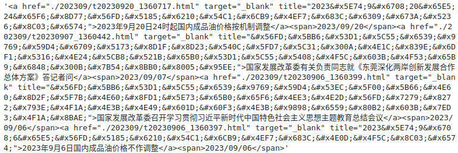

```python
print(pq.text())
```

输出：
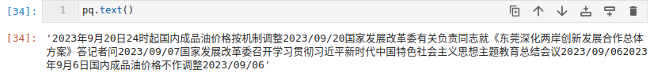
看一下类型：

```python
pq[0]

# <Element span at 0x7f65aa0dd5e0>
```

是一个
lxml.etree._Element 类型，可以用xpath语法解析

 ## **检索方式**
对pyquery对象（'标签'），即可获得所有标签，支持css选择器
.items 可以将每个元素转化成pyquery迭代器

- id选择器 #
- 标签选择器 标签
- 类选择器  .
- 选择器分类 ，
- 后代选择器 空格

```python
for i in pq('a').items():
    print(type(i))
'''
<class 'pyquery.pyquery.PyQuery'>
<class 'pyquery.pyquery.PyQuery'>
<class 'pyquery.pyquery.PyQuery'>
<class 'pyquery.pyquery.PyQuery'>
'''
```

元素属性可以使用attr()方法检索。

```python
for i in pq('a').items():
    print(i.attr('href'))
'''
./202309/t20230920_1360717.html
./202309/t20230907_1360442.html
./202309/t20230906_1360399.html
./202309/t20230906_1360397.html
'''
```

## .remove 删除标签

```python
url = 'https://www.ndrc.gov.cn/xwdt/xwfb/'
reponse = requests.get(url, headers=head)
reponse.encoding= 'utf-8'
pq = PyQuery(reponse.text)
pq('ul.u-list')('li')

# 输出
# [<li>, <li>, <li>, <li>, <li>, <li.empty>, <li>, <li>, <li>, <li>, <li>, <li.empty>, <li>, <li>, <li>, <li>, <li>, <li.empty>, <li>, <li>, <li>, <li>, <li>, <li.empty>, <li>, <li>, <li>, <li>, <li>, <li.empty>]
```

 删除 li.empty 标签

```python
pq('ul.u-list')('li.empty').remove()
pq('ul.u-list')('li')

# 输出
# [<li>, <li>, <li>, <li>, <li>, <li>, <li>, <li>, <li>, <li>, <li>, <li>, <li>, <li>, <li>, <li>, <li>, <li>, <li>, <li>, <li>, <li>, <li>, <li>, <li>]
```

## css选择器

| CSS选择器           | 简易实例                      | 说明                                                         |
| ------------------- | ----------------------------- | ------------------------------------------------------------ |
| [attribute]         | [href]                        | 选择带有href属性的所有元素：doc("[href]")                    |
| [attribute=value]   | [href=bucks]                  | 选择href=bucks的所有元素：doc("[href=bucks]") /doc('[href="bucks"]') |
| [attribute=value]   | a[href="bucks"]               | 选择<a>元素属性href="bucks"的元素：doc('a[href="bucks"]')    |
| [attribute=value    | [class="nobr player desktop"] | 选择class="nobr player desktop"的所有元素：doc('[class *="nobr player desktop"]') |
| [attribute~=value]  | [class~=desktop]              | 选择class属性包含字符串desktop的所有元素:doc("[class~=desktop]") |
| [attribute\|=value] | [href \|= bucks]              | 选择href属性值以"bucks"开头的所以元素:doc('[href \|= bucks]') #调试不稳定 |
| [attribute^=value]  | a[href ^= bu]                 | 选择href属性值以"bu"开头的每个<a>元素:doc('a[href ^= bu]')   |
| [attribute$=value]  | a[href $=cks]                 | 选择href属性值以"bu"结尾的每个<a>元素:doc('a[href $=cks]')   |
| [attribute*=value]  | [class*=desktop]              | 选择class属性包含字符串desktop的所有元素:doc("[class*=desktop]") |

## **伪类选择器**

| 方法              | 说明                           |
| ----------------- | ------------------------------ |
| :first-child      | 获取第一个节点                 |
| :last-child       | 获取最后一个节点               |
| :nth-child(N)     | 获取第N个节点,N=1,2,...        |
| :nth-child(2n)    | 获取偶数位置的全部节点         |
| :nth-child(2n-1)  | 获取奇数位置的全部节点         |
| :gt(N)            | 获取索引大于N的节点，N=0,1,... |
| :contains('雄鹿') | 获取文本包含"雄鹿"的节点       |

# Lesson-11 cookie

在有些网页，需要登录才可以访问服务器，主机发送请求后，附带用户名密码，服务器返回授权码cookie，用户获得后才能访问信息。

Cookie，有时也用其复数形式 Cookies。网站为了辨别用户身份，进行Session跟踪而储存在用户本地终端上的数据（通常经过加密），由用户计算机暂时或永久保存的信息

## 含有cookie的网站访问模式

- 登录 -> 得到cookie

- 带着 cookie 去请求网站

- 服务器响应并返回数据

  

## requests.session()

可以使用session请求，session请求为一连串的请求，在过程中不丢失cookie

```python
# 1、登录，拿cookie
import requests
import json 

session = requests.session()
url = "https://passport.17k.com/ck/user/login"
data = {
    "loginName": "15691762990",
    "password": "q18392556350",
}

response = session.post(url, data=data)
response.cookies
```

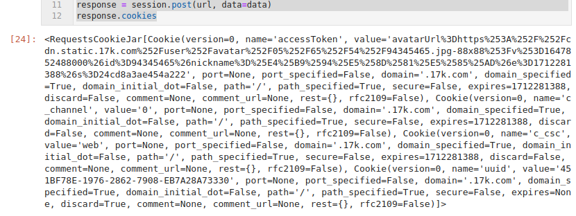

```python
# 2.拿书架上的数据
shelf_url = 'https://user.17k.com/ck/author2/shelf?page=1&appKey=2406394919'
shelf_response = session.get(shelf_url)
json.loads(shelf_response.text)
```

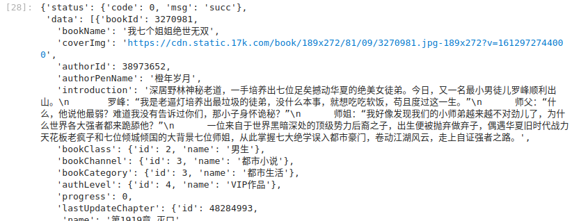

## 直接使用cookie

在浏览器登录后复制cookie，加入请求头直接访问。

```python
# 2.拿书架上的数据
import requests 

head = {
    "User-Agent": "Mozilla/5.0 (X11; Linux x86_64) AppleWebKit/537.36 (KHTML, like Gecko) Chrome/116.0.0.0 Safari/537.36",
    "Cookie": "GUID=0e1a5cc4-e470-4f82-a9e0-246ffcbd1566; BAIDU_SSP_lcr=https://cn.bing.com/; sajssdk_2015_cross_new_user=1; Hm_lvt_9793f42b498361373512340937deb2a0=1696727823; acw_tc=276077cf16967278233445088eaa6acb269b7cd0326bb7a249d53a44850837; accessToken=avatarUrl%3Dhttps%253A%252F%252Fcdn.static.17k.com%252Fuser%252Favatar%252F07%252F27%252F90%252F102009027.jpg-88x88%253Fv%253D1696728151592%26id%3D102009027%26nickname%3D%25E4%25B9%25A6%25E5%258F%258BnM3830117%26e%3D1712280151%26s%3De64d590960291fb7; c_channel=0; c_csc=web; sensorsdata2015jssdkcross=%7B%22distinct_id%22%3A%22102009027%22%2C%22%24device_id%22%3A%2218b0cdbf3df1db6-00f8588cb8d5e2-11462c6c-2073600-18b0cdbf3e019a7%22%2C%22props%22%3A%7B%22%24latest_traffic_source_type%22%3A%22%E8%87%AA%E7%84%B6%E6%90%9C%E7%B4%A2%E6%B5%81%E9%87%8F%22%2C%22%24latest_referrer%22%3A%22https%3A%2F%2Fcn.bing.com%2F%22%2C%22%24latest_referrer_host%22%3A%22cn.bing.com%22%2C%22%24latest_search_keyword%22%3A%22%E6%9C%AA%E5%8F%96%E5%88%B0%E5%80%BC%22%7D%2C%22first_id%22%3A%220e1a5cc4-e470-4f82-a9e0-246ffcbd1566%22%7D; Hm_lpvt_9793f42b498361373512340937deb2a0=1696728359",
}

shelf_url = 'https://user.17k.com/ck/author2/shelf?page=1&appKey=2406394919'
shelf_response = requests.get(shelf_url, headers=head)
shelf_response.json()
```

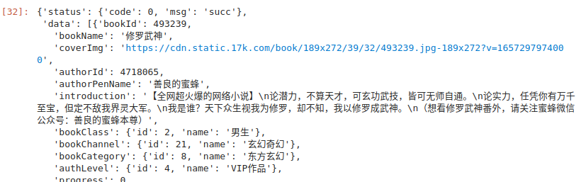

# Lesson-13 多线程和多进程

## 进程

运行中的程序，独立的运行程序，进程是资源的基本最小单位，有独立内存，是并行操作。

### 多进程创建

```python
from multiprocessing import Process
from datetime import datetime

def func(name):
    for i in range(100):
        print(i, "===", name)
    return name

# 创建进程
p1 = Process(target=func, args=("周杰伦",))
p2 = Process(target=func, args=("李克勤",))


# 执行
p1.start()
p2.start()
```

同时发生任务，并行。


## 线程

线程是cpu调度的基本最小单位，cpu调动最小资源，通过线程执行资源，一个进程可以拿着资源开若干个线程，不同线程之间交替执行。

### 4个线程同时进行

```python
from threading import Thread


# 创建任务
def func(name):
    for i in range(10000):
        print(i, "===", name)


# 创建线程
t1 = Thread(target=func, args=("周杰伦",))
t2 = Thread(target=func, args=("李克勤",))
t3 = Thread(target=func, args=("那英",))
t4 = Thread(target=func, args=("你好",))


# 执行
t1.start()
t2.start()
t3.start()
t4.start()
```

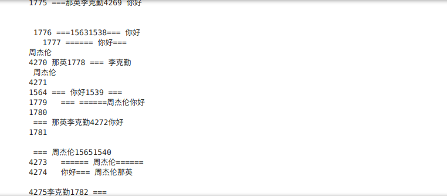

### 面向对象多线程程序

继thread并重写Thread的run方法

```python
from threading import Thread

class MyThread(Thread):
    def __init__(self, name):
        # 继承参数
        super(MyThread, self).__init__()
        self.name = name
    
    # 重写run方法
    def run(self):
        for i in range(10000):
            print(i, "===", self.name)

# 创建线程
t1 = MyThread("周杰伦")
t2 = MyThread("李克勤")
t3 = MyThread("那英")
t4 = MyThread("你好")

# 执行
t1.start()
t2.start()
t3.start()
t4.start()
```

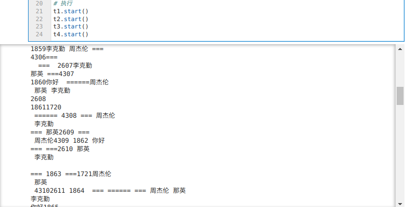

### 线程池

线程是不能随便创建的，所以需要控制线程数量，线程池可以完成这项工作

#### 无返回

```python
from concurrent.futures import ThreadPoolExecutor

# 创建任务
def func(name):
    for i in range(10000):
        print(i, "===", name)

# 创建线程池
with ThreadPoolExecutor(10) as t:
    for i in range(10):
        t.submit(func, "周杰伦"+'=='+str(i))

```

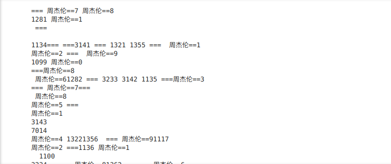

#### 有返回值

- 方法1

```python
from concurrent.futures import ThreadPoolExecutor


# 创建任务
def func(name):
    print(i, "===", name)
    return name


# 创建线程池 并获取返回值
# add_done_callback 任务完成之后立即执行
with ThreadPoolExecutor(10) as t:
    t.submit(func, "周杰伦").add_done_callback(lambda res: print(res.result()))
    t.submit(func, "李克勤").add_done_callback(lambda res: print(res.result()))
    t.submit(func, "那英").add_done_callback(lambda res: print(res.result()))
```

- 方法2

```python
from concurrent.futures import ThreadPoolExecutor


# 创建任务
def func(name):
    print(i, "===", name)
    return name


# 创建线程池 并获取返回值
# add_done_callback 任务完成之后立即执行
with ThreadPoolExecutor(10) as t:
    result = t.map(func, ["周杰伦", "李克勤", "那英"])
print(list(result))
```

## 何时使用多线程，何时使用多进程

多线程：任务相对统一，互相特别相似

多进程：多个任务相互独立，很少有交集

比如：免费ip池

- 1、从免费网站抓取代理ip
- 2、验证ip是否可用
- 3、准备对外的接口

## 实战

### 多进程

```python
# 整合版
import json
import os
import re
import time
from concurrent.futures import ThreadPoolExecutor
from datetime import datetime, timedelta
from multiprocessing import Process, Queue
from urllib.parse import urljoin

import numpy as np
import pandas as pd
import requests
from pyquery import PyQuery

head = {
    "User-Agent": np.random.choice(
        [
            "Mozilla/5.0 (Windows NT 6.1) AppleWebKit/537.36 (KHTML, like Gecko) Chrome/41.0.2228.0 Safari/537.36",
            "Mozilla/5.0 (Macintosh; Intel Mac OS X 10_10_1) AppleWebKit/537.36 (KHTML, like Gecko) Chrome/41.0.2227.1 Safari/537.36",
            "Mozilla/5.0 (X11; Linux x86_64) AppleWebKit/537.36 (KHTML, like Gecko) Chrome/41.0.2227.0 Safari/537.36",
            "Mozilla/5.0 (Windows NT 6.1; WOW64) AppleWebKit/537.36 (KHTML, like Gecko) Chrome/41.0.2227.0 Safari/537.36",
            "Mozilla/5.0 (Windows NT 6.3; WOW64) AppleWebKit/537.36 (KHTML, like Gecko) Chrome/41.0.2226.0 Safari/537.36",
            "Mozilla/5.0 (compatible; MSIE 9.0; Windows NT 6.1; Trident/5.0; chromeframe/13.0.782.215)",
            "Mozilla/5.0 (compatible; MSIE 9.0; Windows NT 6.1; Trident/5.0; chromeframe/11.0.696.57)",
            "Mozilla/5.0 (compatible; MSIE 9.0; Windows NT 6.1; Trident/5.0) chromeframe/10.0.648.205",
            "Mozilla/5.0 (compatible; MSIE 9.0; Windows NT 6.1; Trident/4.0; GTB7.4; InfoPath.1; SV1; .NET CLR 2.8.52393; WOW64; en-US)",
            "Mozilla/5.0 (compatible; MSIE 9.0; Windows NT 6.0; Trident/5.0; chromeframe/11.0.696.57)",
            "Mozilla/5.0 (compatible; MSIE 9.0; Windows NT 6.0; Trident/4.0; GTB7.4; InfoPath.3; SV1; .NET CLR 3.1.76908; WOW64; en-US)",
            "Mozilla/5.0 (Macintosh; Intel Mac OS X 10_9_3) AppleWebKit/537.75.14 (KHTML, like Gecko) Version/7.0.3 Safari/7046A194A",
            "Mozilla/5.0 (iPad; CPU OS 6_0 like Mac OS X) AppleWebKit/536.26 (KHTML, like Gecko) Version/6.0 Mobile/10A5355d Safari/8536.25",
            "Mozilla/5.0 (Macintosh; Intel Mac OS X 10_6_8) AppleWebKit/537.13+ (KHTML, like Gecko) Version/5.1.7 Safari/534.57.2",
            "Mozilla/5.0 (Macintosh; Intel Mac OS X 10_7_3) AppleWebKit/534.55.3 (KHTML, like Gecko) Version/5.1.3 Safari/534.53.10",
            "Mozilla/5.0 (iPad; CPU OS 5_1 like Mac OS X) AppleWebKit/534.46 (KHTML, like Gecko ) Version/5.1 Mobile/9B176 Safari/7534.48.3",
        ]
    )
}


def get_today_and_lastday():
    t = datetime.now()
    oneday = timedelta(days=1)
    yesterday = t - oneday
    return datetime(year=t.year, month=t.month, day=t.day), datetime(
        year=yesterday.year, month=yesterday.month, day=yesterday.day
    )


## 1、抓取信息网页
def get_li_list(url, end_time, queue, page=0):
    if page != 0:
        crawl_url = url + "_%s" % page + ".htm"
    else:
        crawl_url = url + ".htm"

    response = requests.get(crawl_url, headers=head)
    response.encoding = "utf-8"
    pq = PyQuery(response.text)

    li_info_list = [
        [urljoin(crawl_url, i("a").attr("href")), i("a").text(), i("span").text()]
        for i in list(pq("ul.xwfb_listbox > li").items())
    ]

    # 获取当页最早文章发布时间
    publish_time = datetime.strptime(li_info_list[-1][-1], "%Y-%m-%d")

    # 如果时间时间小于截至时间，停止
    if publish_time < end_time:
        return li_info_list

    # 否则翻页，递归执行
    page += 1
    li_info_list += get_li_list(url, end_time, queue, page)

    for i in li_info_list:
        if (
            datetime.strptime(i[-1], "%Y-%m-%d") >= end_time
            and datetime.strptime(i[-1], "%Y-%m-%d") < begin_time
        ):
            queue.put(i)
    return li_info_list


## 多线程作业
def get_url(q, end_time):
    url_list = [
        "https://www.mof.gov.cn/zhengwuxinxi/caizhengxinwen/index",
        "https://www.mof.gov.cn/zhengwuxinxi/zhengcefabu/index",
        "https://www.mof.gov.cn/zhengwuxinxi/zhengcejiedu/index",
    ]
    with ThreadPoolExecutor(num_executor) as t:
        for url in url_list:
            t.submit(get_li_list, url, end_time, q, page=0)


# 第二步多线程抓取网页信息
def insert_db_data(data):
    response = requests.get(data[0], headers=head)
    response.encoding = "utf-8"
    pq = PyQuery(response.text)

    db_insert_data.append(
        [
            # crawl_time 爬取时间
            datetime.now(),
            # publish_time 发布时间
            datetime.strptime(data[-1], "%Y-%m-%d"),
            # 原始网址
            data[0],
            # 网站模块
            pq("div.dangqian").text().split(">")[-1],
            # 标题
            pq("div.box_content > h2.title_con").text().replace("\n", ""),
            # 作者或来源
            "中华人民共和国财政部",
            # 文章内容
            pq("div.TRS_Editor >p").text(),
            # 附件 存储附件地址 media/app03/data/
            "",
        ]
    )
    # (pq("div.box_content > h2.title_con").text(), ">>>>>", "插入队列"） 可打印


def get_url_info(
    q,
):
    with ThreadPoolExecutor(num_executor) as t:
        while True:
            if q.empty():
                break
            data = q.get()
            t.submit(insert_db_data, data)


## main函数
def spider():
    get_url(q, end_time)
    get_url_info(q)
    return db_insert_data


## 全局函数
q = Queue()
begin_time = datetime.now()
end_time = datetime(2023, 10, 1)
db_insert_data = []
num_executor = 5
```

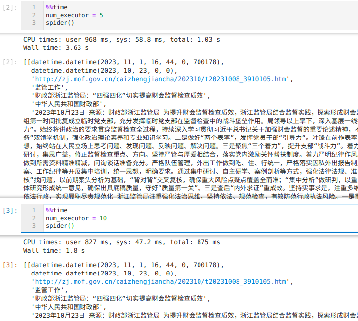

### 多进程+多线程

```python
# 整合版

import json
import os
import re
import time
from concurrent.futures import ThreadPoolExecutor
from datetime import datetime, timedelta
from multiprocessing import Pool, Process, Queue
from urllib.parse import urljoin

import numpy as np
import pandas as pd
import requests
from pyquery import PyQuery

head = {
    "User-Agent": np.random.choice(
        [
            "Mozilla/5.0 (Windows NT 6.1) AppleWebKit/537.36 (KHTML, like Gecko) Chrome/41.0.2228.0 Safari/537.36",
            "Mozilla/5.0 (Macintosh; Intel Mac OS X 10_10_1) AppleWebKit/537.36 (KHTML, like Gecko) Chrome/41.0.2227.1 Safari/537.36",
            "Mozilla/5.0 (X11; Linux x86_64) AppleWebKit/537.36 (KHTML, like Gecko) Chrome/41.0.2227.0 Safari/537.36",
            "Mozilla/5.0 (Windows NT 6.1; WOW64) AppleWebKit/537.36 (KHTML, like Gecko) Chrome/41.0.2227.0 Safari/537.36",
            "Mozilla/5.0 (Windows NT 6.3; WOW64) AppleWebKit/537.36 (KHTML, like Gecko) Chrome/41.0.2226.0 Safari/537.36",
            "Mozilla/5.0 (compatible; MSIE 9.0; Windows NT 6.1; Trident/5.0; chromeframe/13.0.782.215)",
            "Mozilla/5.0 (compatible; MSIE 9.0; Windows NT 6.1; Trident/5.0; chromeframe/11.0.696.57)",
            "Mozilla/5.0 (compatible; MSIE 9.0; Windows NT 6.1; Trident/5.0) chromeframe/10.0.648.205",
            "Mozilla/5.0 (compatible; MSIE 9.0; Windows NT 6.1; Trident/4.0; GTB7.4; InfoPath.1; SV1; .NET CLR 2.8.52393; WOW64; en-US)",
            "Mozilla/5.0 (compatible; MSIE 9.0; Windows NT 6.0; Trident/5.0; chromeframe/11.0.696.57)",
            "Mozilla/5.0 (compatible; MSIE 9.0; Windows NT 6.0; Trident/4.0; GTB7.4; InfoPath.3; SV1; .NET CLR 3.1.76908; WOW64; en-US)",
            "Mozilla/5.0 (Macintosh; Intel Mac OS X 10_9_3) AppleWebKit/537.75.14 (KHTML, like Gecko) Version/7.0.3 Safari/7046A194A",
            "Mozilla/5.0 (iPad; CPU OS 6_0 like Mac OS X) AppleWebKit/536.26 (KHTML, like Gecko) Version/6.0 Mobile/10A5355d Safari/8536.25",
            "Mozilla/5.0 (Macintosh; Intel Mac OS X 10_6_8) AppleWebKit/537.13+ (KHTML, like Gecko) Version/5.1.7 Safari/534.57.2",
            "Mozilla/5.0 (Macintosh; Intel Mac OS X 10_7_3) AppleWebKit/534.55.3 (KHTML, like Gecko) Version/5.1.3 Safari/534.53.10",
            "Mozilla/5.0 (iPad; CPU OS 5_1 like Mac OS X) AppleWebKit/534.46 (KHTML, like Gecko ) Version/5.1 Mobile/9B176 Safari/7534.48.3",
        ]
    )
}


def get_today_and_lastday():
    t = datetime.now()
    oneday = timedelta(days=1)
    yesterday = t - oneday
    return datetime(year=t.year, month=t.month, day=t.day), datetime(
        year=yesterday.year, month=yesterday.month, day=yesterday.day
    )


## 1、抓取信息网页
def get_li_list(url, end_time, queue, page=0):
    if page != 0:
        crawl_url = url + "_%s" % page + ".htm"
    else:
        crawl_url = url + ".htm"

    response = requests.get(crawl_url, headers=head)
    response.encoding = "utf-8"
    pq = PyQuery(response.text)

    li_info_list = [
        [urljoin(crawl_url, i("a").attr("href")), i("a").text(), i("span").text()]
        for i in list(pq("ul.xwfb_listbox > li").items())
    ]

    # 获取当页最早文章发布时间
    publish_time = datetime.strptime(li_info_list[-1][-1], "%Y-%m-%d")

    # 如果时间时间小于截至时间，停止
    if publish_time < end_time:
        return li_info_list

    # 否则翻页，递归执行
    page += 1
    li_info_list += get_li_list(url, end_time, queue, page)

    for i in li_info_list:
        if (
            datetime.strptime(i[-1], "%Y-%m-%d") >= end_time
            and datetime.strptime(i[-1], "%Y-%m-%d") < begin_time
        ):
            queue.put(i)
    return li_info_list


## 多线程作业
def get_url(q, end_time):
    url_list = [
        "https://www.mof.gov.cn/zhengwuxinxi/caizhengxinwen/index",
        "https://www.mof.gov.cn/zhengwuxinxi/zhengcefabu/index",
        "https://www.mof.gov.cn/zhengwuxinxi/zhengcejiedu/index",
    ]
    with ThreadPoolExecutor(num_executor) as t:
        for url in url_list:
            t.submit(get_li_list, url, end_time, q, page=0)
    q.put("End")


# 第二步多线程抓取网页信息
def insert_db_data(data, db_insert_data):
    response = requests.get(data[0], headers=head)
    response.encoding = "utf-8"
    pq = PyQuery(response.text)
    db_insert_data.put(
        [
            # crawl_time 爬取时间
            datetime.now(),
            # publish_time 发布时间
            datetime.strptime(data[-1], "%Y-%m-%d"),
            # 原始网址
            data[0],
            # 网站模块
            pq("div.dangqian").text().split(">")[-1],
            # 标题
            pq("div.box_content > h2.title_con").text().replace("\n", ""),
            # 作者或来源
            "中华人民共和国财政部",
            # 文章内容
            pq("div.TRS_Editor >p").text(),
            # 附件 存储附件地址 media/app03/data/
            "",
        ]
    )
    # print(db_insert_data.qsize())
    # print(pq("div.box_content > h2.title_con").text(), ">>>>>", "插入队列")


def get_url_info(q, db_insert_data, t1):
    with ThreadPoolExecutor(num_executor) as t:
        while True:
            data = q.get()
            if data == "End":
                break
            t.submit(insert_db_data, data, db_insert_data)

    T2 = time.time()
    print("程序运行时间:%s秒" % (round(T2 - t1, 2)))
    db_insert_data.put("运行完毕！")


## 全局函数
# 全局变量在多进程之间数据不共享，需要用queue
q = Queue()
begin_time = datetime.now()
end_time = datetime(2023, 9, 1)
db_insert_data = Queue()
num_executor = 10
```

```python
# 计时
T1 = time.time()

# 创建进程
p1 = Process(target=get_url, args=(q, end_time))
p2 = Process(target=get_url_info, args=(q, db_insert_data, T1))

p1.start()
p2.start()


# 子进程可以调用队列的 Queue.cancel_join_thread 方法禁止这种行为）
# 这意味着，任何使用队列的时候，你都要确保在进程join之前，所有存放到队列中的项将会被其他进程、线程完全消费。否则不能保证这个写过队列的进程可以正常终止。记住非精灵进程会自动 join 。
# 如果共享资源，join 会导致死锁

# p1.join()
# p2.join()
```

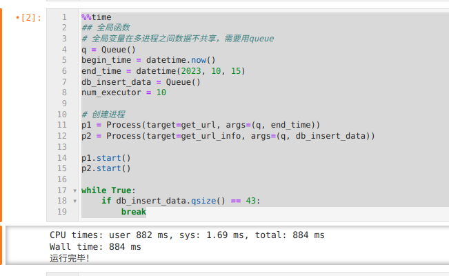

有明显的速度提升！

# Lesson-14 多任务异步协程

## 协程

IO操作 -> 阻塞

协程思想：在程序发生阻塞事，线程运行可以先运行的资源任务后，将阻塞任务切换回来继续运行

### python代码

```python
import asyncio

# 异步函数
async def func(): # 返回协程对象
    print("我是函数")


if __name__ == '__main__': 
    # 协程对象需要线程中 event loop 监控执行 
    f = func()
    
    '''
    # # 获取 event loop
    # event_loop = asyncio.get_event_loop()
    # # 注册 f 函数直至其停止
    # event_loop.run_until_complete(f)
    '''
    
    #上述等价 asyncio.run(f)
    asyncio.run(f)
```

终端运行：

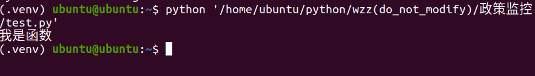

```python
import asyncio
import time

# 异步函数
async def func1():  # 返回协程对象
    print("我是函数func1")
    # 挂起的步骤
    await asyncio.sleep(1)
    print("func1结束")


async def func2():  # 返回协程对象
    print("我是函数func2")
    await asyncio.sleep(2)
    print("func2结束")


async def func3():  # 返回协程对象
    print("我是函数func3")
    await asyncio.sleep(3)
    print("func3结束")


if __name__ == "__main__":
    # 协程对象需要线程中 event loop 监控执行
    # 计时
    t1 = time.time()
    f1 = func1()
    f2 = func2()
    f3 = func3()

    tasks = [f1, f2, f3]

    # 上述等价 asyncio.wait(tasks) 等待任务全部完成
    asyncio.run(asyncio.wait(tasks))

    t2 = time.time()
    print("运行时间：", round(t2 - t1, 2),'s')
```

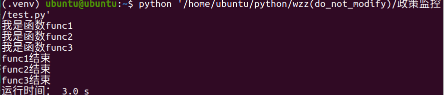

### 标准写法

```python
import asyncio
import time


# 异步函数
async def download(url):  # 返回协程对象
    print("我要下载了")
    # 挂起的步骤
    await asyncio.sleep(url)
    print("下载完成")


async def main():  # 返回协程对象
    urls = [1, 2, 3]

    # 封装任务列表
    tasks = []
    for i in urls:
        # python3.8以上需要创建任务对象
        task = asyncio.create_task(download(i))
        tasks.append(task)
    await asyncio.wait(tasks)


if __name__ == "__main__":
    # 计时
    t1 = time.time()

    asyncio.run(main())

    t2 = time.time()
    print("运行时间：", round(t2 - t1, 2), "s")
```

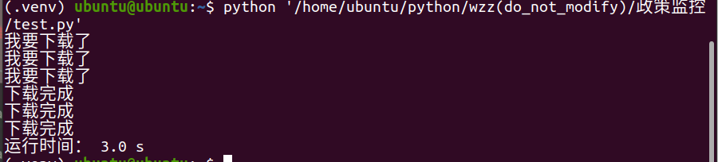

### 协程返回值

```python
import asyncio
import time

# 异步函数
async def func1():  # 返回协程对象
    print("我是函数func1")
    # 挂起的步骤
    await asyncio.sleep(1)
    print("func1结束")
    return 'func1'


async def func2():  # 返回协程对象
    print("我是函数func2")
    await asyncio.sleep(2)
    print("func2结束")
    return 'func2'   


async def func3():  # 返回协程对象
    print("我是函数func3")
    await asyncio.sleep(3)
    print("func3结束")
    return 'func3'
    

async def main():
    tasks = [
    asyncio.create_task(func1()),
    asyncio.create_task(func2()),
    asyncio.create_task(func3()),
    ]
    
    # done 为结束，pending为运行状态
    done, pending = await asyncio.wait(tasks)
    # done 为set类型, 里面元素类型为 <class '_asyncio.Task'>
    print([i.result() for i in done])
    

if __name__ == '__main__':
    asyncio.run(main())
```

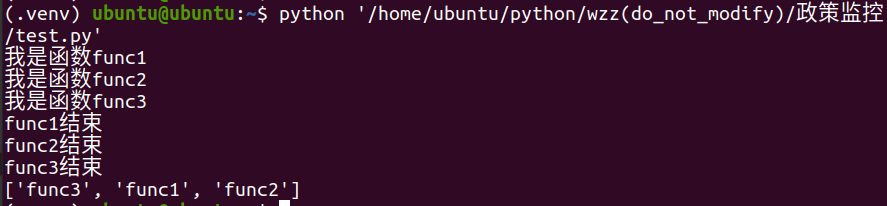

```python
import asyncio
import time


# 异步函数
async def func1():  # 返回协程对象
    print("我是函数func1")
    # 挂起的步骤
    await asyncio.sleep(1)
    a = 1 / 0
    print("func1结束")
    return "func1"


async def func2():  # 返回协程对象
    print("我是函数func2")
    await asyncio.sleep(2)
    print("func2结束")
    return "func2"


async def func3():  # 返回协程对象
    print("我是函数func3")
    await asyncio.sleep(3)
    print("func3结束")
    return "func3"


async def main():
    tasks = [
        asyncio.create_task(func1()),
        asyncio.create_task(func2()),
        asyncio.create_task(func3()),
    ]

    """
    # done 为结束，pending为运行状态
    done, pending = await asyncio.wait(tasks)
    # done 为set类型, 里面元素类型为 <class '_asyncio.Task'>
    print([i.result() for i in done])
    """

    # 返回值等价于上述注释，gather按照tasks顺序决定
    # 该步骤 + await 原因是后面步骤需要完成所有任务够执行，所以要挂起返回结果
    result = await asyncio.gather(*tasks, return_exceptions=True)

    print("gather:", result, type(result))


if __name__ == "__main__":
    asyncio.run(main())
```

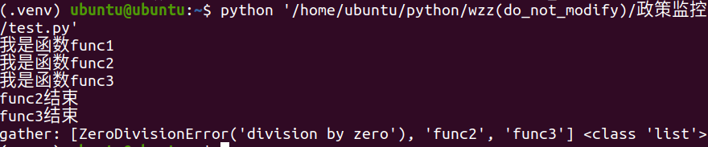

### aiohttp, aiofiles

```python
import asyncio
import time

import aiofiles
import aiohttp
import numpy as np

head = {
    "User-Agent": np.random.choice(
        [
            "Mozilla/5.0 (Windows NT 6.1) AppleWebKit/537.36 (KHTML, like Gecko) Chrome/41.0.2228.0 Safari/537.36",
            "Mozilla/5.0 (Macintosh; Intel Mac OS X 10_10_1) AppleWebKit/537.36 (KHTML, like Gecko) Chrome/41.0.2227.1 Safari/537.36",
            "Mozilla/5.0 (X11; Linux x86_64) AppleWebKit/537.36 (KHTML, like Gecko) Chrome/41.0.2227.0 Safari/537.36",
            "Mozilla/5.0 (Windows NT 6.1; WOW64) AppleWebKit/537.36 (KHTML, like Gecko) Chrome/41.0.2227.0 Safari/537.36",
            "Mozilla/5.0 (Windows NT 6.3; WOW64) AppleWebKit/537.36 (KHTML, like Gecko) Chrome/41.0.2226.0 Safari/537.36",
            "Mozilla/5.0 (compatible; MSIE 9.0; Windows NT 6.1; Trident/5.0; chromeframe/13.0.782.215)",
            "Mozilla/5.0 (compatible; MSIE 9.0; Windows NT 6.1; Trident/5.0; chromeframe/11.0.696.57)",
            "Mozilla/5.0 (compatible; MSIE 9.0; Windows NT 6.1; Trident/5.0) chromeframe/10.0.648.205",
            "Mozilla/5.0 (compatible; MSIE 9.0; Windows NT 6.1; Trident/4.0; GTB7.4; InfoPath.1; SV1; .NET CLR 2.8.52393; WOW64; en-US)",
            "Mozilla/5.0 (compatible; MSIE 9.0; Windows NT 6.0; Trident/5.0; chromeframe/11.0.696.57)",
            "Mozilla/5.0 (compatible; MSIE 9.0; Windows NT 6.0; Trident/4.0; GTB7.4; InfoPath.3; SV1; .NET CLR 3.1.76908; WOW64; en-US)",
            "Mozilla/5.0 (Macintosh; Intel Mac OS X 10_9_3) AppleWebKit/537.75.14 (KHTML, like Gecko) Version/7.0.3 Safari/7046A194A",
            "Mozilla/5.0 (iPad; CPU OS 6_0 like Mac OS X) AppleWebKit/536.26 (KHTML, like Gecko) Version/6.0 Mobile/10A5355d Safari/8536.25",
            "Mozilla/5.0 (Macintosh; Intel Mac OS X 10_6_8) AppleWebKit/537.13+ (KHTML, like Gecko) Version/5.1.7 Safari/534.57.2",
            "Mozilla/5.0 (Macintosh; Intel Mac OS X 10_7_3) AppleWebKit/534.55.3 (KHTML, like Gecko) Version/5.1.3 Safari/534.53.10",
            "Mozilla/5.0 (iPad; CPU OS 5_1 like Mac OS X) AppleWebKit/534.46 (KHTML, like Gecko ) Version/5.1 Mobile/9B176 Safari/7534.48.3",
        ]
    )
}


# 异步函数
async def download(url):
    file_name = url.split("/")[-1]
    # 相当与requests
    async with aiohttp.ClientSession() as session:
        # 发送网络请求
        async with session.get(url, headers=head) as resp:
            content = await resp.content.read()
            # 写入文件
            async with aiofiles.open(file_name, mode="wb") as f:
                await f.write(content)


async def main():
    url_list = [
        "https://cache.yisu.com/upload/information/20200622/113/63125.png",
        "http://img.netbian.com/file/2023/1102/085520GVObk.jpg",
    ]
    tasks = []
    for url in url_list:
        tasks.append(asyncio.create_task(download(url)))

    await asyncio.wait(tasks)
    print("完成")


if __name__ == "__main__":
    asyncio.run(main())
```


